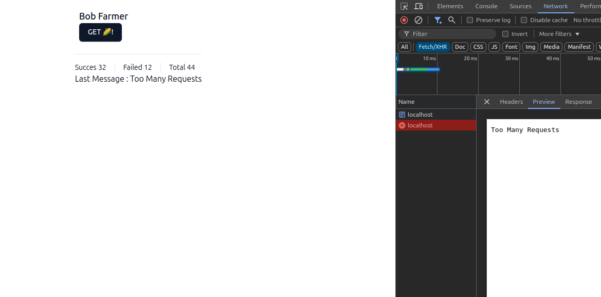

# Bob’s corn solution

Mi solucion al caso tecnico

## Database

> docker compose up

## App

> npm install
> npm run dev

Detalles de mi solucion:

- Evite el uso de ORMs y librerias adicionales, solo pg con express
  para el API
- Coloque todo en un monorepo (usando turborepo) usando express para
  el API (tenia duda si debia usar C#)
- No me dedique a hacer detalles de UI me limite a instalar la libreria Shadcn y agregar un componente.
- Para este tipo de soluciones se pueden usar otras librerias y herramientas como Redis tomando en cuenta el rendimiento y escalabilidad
- Se agregaron los .env al al repo

